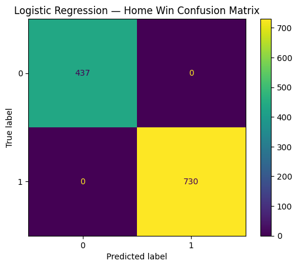
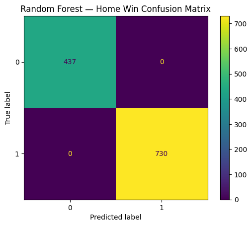
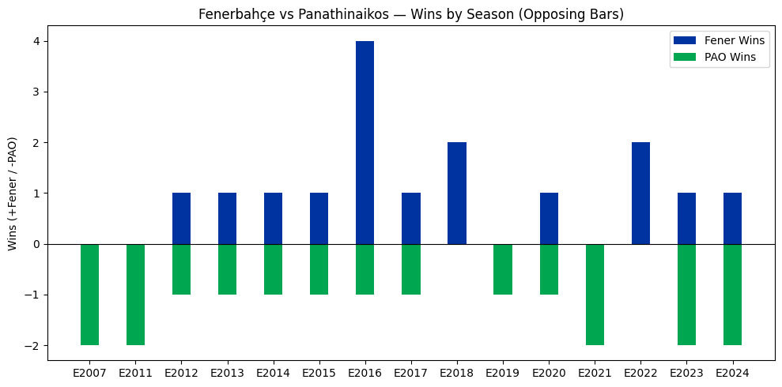

# 🏀 Euroleague Match Winner Predictor

This project builds an end-to-end **data-engineering + machine-learning pipeline** using open Euroleague datasets (2007 – 2026).  
It prepares, cleans, integrates, and models basketball data to predict whether the **home team wins** a game — and includes a fun rivalry analysis: *Fenerbahçe vs Panathinaikos.*

---

## 📁 Project Structure
| Folder / File | Purpose |
|----------------|----------|
| `data/` | Raw Euroleague CSVs from Kaggle |
| `clean_data/` | Cleaned and integrated datasets |
| `01_data_cleaning_and_exploration.ipynb` | Standardizes columns, parses dates, validates keys |
| `02_data_integration_and_features.ipynb` | Joins tables, aggregates boxscores, builds features |
| `03_modeling_and_evaluation.ipynb` | Trains Logistic Regression & Random Forest models |
| `README.md` | Project summary & usage guide |

---

## 🧹 Stage 1 — Data Cleaning & Exploration
- Unified column naming (`snake_case`)
- Parsed and validated dates (`NaT` for invalid entries)
- Verified relational keys (`game_id`, `team_id`, `season_code`)
- Separated raw vs. cleaned data (`data/` → `clean_data/`)

---

## 🧩 Stage 2 — Data Integration & Feature Building
- Aggregated player boxscores → **team totals per game**
- Engineered metrics (FG2%, FG3%, FT%, rebounds, AST/TOV)
- Created **home vs away** feature sets
- Generated `home_win` binary label
- Exported modeling-ready dataset `games_features.csv`
- Added **Fenerbahçe vs Panathinaikos head-to-head** extractor (34 games found)

---

## 🧠 Stage 3 — Modeling & Evaluation
- Split data into training/testing sets  
- Trained **Logistic Regression** (baseline) and **Random Forest** (non-linear) models  
- Evaluated accuracy & confusion matrices  
- Visualized **feature importance** (key predictors: rebounds, assists, shooting %)  
- Produced **rivalry charts** for Fenerbahçe vs Panathinaikos wins per season  

> ⚠️  Perfect accuracy on the first run revealed **data leakage** (post-game stats).  
>  This was used as a learning example to highlight feature selection and predictive validity.

---

## 🔍 Example Output
```text
Fener vs Panathinaikos — Head-to-Head Summary
Total games: 34
Fener wins:  16
PAO wins:    18
```

---

## 📊 Visual Results

The following charts illustrate key outcomes from the project’s data analysis, modeling, and rivalry exploration.

### 🧠 Model Evaluation — Confusion Matrix


> *The confusion matrix for Logistic Regression shows perfect classification accuracy — revealing post-game stat leakage and emphasizing the importance of proper feature engineering.*

---

### ⚙️ Feature Importance — Random Forest


> *Top statistical indicators for home wins include overall valuation, points scored, and shooting percentages — offering interpretable insights into what drives success.*

---

### 🏀 Fenerbahçe vs Panathinaikos — Wins per Season


> *A rivalry summary extracted from 17+ seasons of Euroleague data — 34 total games, with Fenerbahçe winning 16 and Panathinaikos 18. The chart highlights competitive balance and key seasons such as 2016.*

---

## 🧩 Project Summary
This project demonstrates the full lifecycle of a data engineering workflow:
- Data ingestion and cleaning of multi-season Euroleague datasets  
- Feature integration from boxscores, team stats, and outcomes  
- Machine learning modeling for win prediction  
- Real-world storytelling through exploratory analysis  

📘 *Built entirely with Python, Pandas, and Scikit-Learn.*

---


